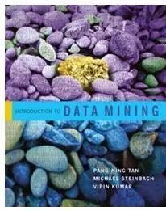
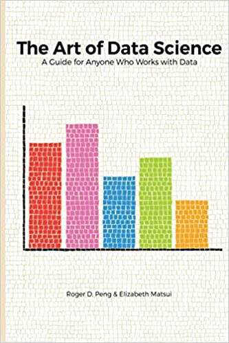

# Biography
---

She is currently an Assistant Professor with the [College of Computer Science and Software Engineering](https://csse.szu.edu.cn/pages/user/index?id=1309), [Shenzhen University](https://www.szu.edu.cn/), China. Before joining Shenzhen University, she was a Senior Researcher with [Tencent Technology Co., Ltd.](https://www.tencent.com/) from 2018 to 2021. She received her Ph.D degree in computer science from [University of Technology Sydney (UTS)](https://www.uts.edu.au/), Australia (2018), supervised by [Prof. Chengqi Zhang](https://profiles.uts.edu.au/Chengqi.Zhang), [A.P. Guodong Long](https://profiles.uts.edu.au/Guodong.Long) and Prof. Peng Zhang, and got her master’s degree from [University of Chinese Academy of Science (UCAS)](https://www.ucas.ac.cn/), Beijing, China, supervised by [Prof. Yingjie Tian](https://people.ucas.ac.cn/~tianyingjie?language=en). During September 2017 to March 2018, She was fortunate to visit [Prof. Wei Wang](https://web.cs.ucla.edu/~weiwang/) with Department of [Computer Science](https://www.cs.ucla.edu/) at [University of California, Los Angeles (UCLA)](https://www.ucla.edu/).In the past few years, she has been recognized as Overseas High-Caliber Personnel (深圳市海外高层次人才), High-level Talent in Nanshan District of Shenzhen (南山区领航人才).

Her research interests focus on **graph learning**, **natural language processing**, and **open-world machine learning**, etc. She have made contributions to advance graph machine learning methods for solving hard open-world AI problems for real-life applications, including node classification, question answering, anomaly detection, recommender systems and time series clustering. She has published more than 40 research papers in top journals and conferences, including **TPAMI, TKDE, TCYB, NeurIPS, AAAI, IJCAI, CVPR, WWW, ACM MM,** etc., and received several research funds Youth Program of National Natural Science Foundation and General Program of Natural Science Foundation of Guangdong Province. 

# Interests
---

- **Graph Learning**: Graph out-of-distribution detection and generalization, Grpah open-set learning, Graph robust learning;
- **NLP**: LLMs, Question Answering, Reasoning.
  
# News
---

- **Sep, 2024**: A paper, “EGonc : Energy-based Open-Set Node Classification with substitute Unknowns”, is accepted by NeurIPS, 2024. Congratulations, Zelin!
- **Sep, 2024**: A paper, “CHAmbi: A New Benchmark on Chinese Ambiguity Challenges for Large Language Models”, is accepted by EMNLP, 2024. Congratulations, Sihan!
- **July, 2024**: A paper, “Open-world Structured Sequence Learning Via Dense Target Encoding”, is accepted by Information Sciences, 2024. Congratulations, Ziqi!
- **July, 2024**: A paper, “ReCoS: A Novel Benchmark for Cross-Modal Image-Text Retrieval in Complex Real-Life Scenarios”, is accepted by ACM MM, 2024. Congratulations, Jimeng!
- **July, 2024**: A paper, “A Payment Transaction Pre-training Model for Fraud Transaction Detection”, is accepted by CIKM, 2024. Congratulations, Wenxi!
- **Aug, 2024**: I will attend and serve as a session chair in IJCAI 2024 in Jeju Island, South Korea. Hope to see you there.
- **May, 2024**: A paper, “End-to-end approach of multi-grained embedding of categorical features in tabular data”, is accepted by IPM, 2024. Congratulations, Han Liu!
- **May, 2024**: A paper, “A fine-grained self-adapting prompt learning approach for few-shot learning with pre-trained language models”, is accepted by KBS, 2024. Congratulations, Xiaojun!
- **Apr, 2024**: A paper, “CONC: Complex-noise-resistant Open-set Node Classification with Adaptive Noise Detection”, is accepted by IJCAI, 2024. Congratulations, Jiexin!
- **May, 2024**: A paper, “PH-Net: Semi-Supervised Breast Lesion Segmentation via Patch-wise Hardness”, is accepted by CVPR, 2024. Congratulations, Siyao!
- **Dec, 2023**: Two papers, “ROGPL: Robust Open-Set Graph Learning via Region-based Prototype Learning” and “Multi-level Cross-modal Alignment for Image Clustering”, are accepted by AAAI 2024. Congratulations, Xiaowei and Liping!
- **Dec, 2023**: A paper, “Unsupervised multiple choices question answering via universal corpus”, is accepted by ICASSP, 2024. Congratulations, Hao Ge!

# Ten Representative Works
---

- **EGonc : Energy-based Open-Set Node Classification with substitute Unknowns.**
     **Qin Zhang**, Zelin Shi, Shirui Pan, Junyang Chen, Huisi Wu, Xiaojun Chen\*
     Annual Conference on Neural Information Processing Systems (**NeurIPS**). Accepted, 2024.
     [[PDF](publications2024/EGonc-NeurIPS2024.pdf)\]
    

- **Salient subsequence learning for time series clustering**
     **Qin Zhang**, jia Wu, Pen Zhang, Guodong Long, Chengqi Zhang\*
     IEEE transactions on pattern analysis and machine intelligence (**TPAMI**), 41(9): 2193-2207, 2019.
     [[PDF](https://ieeexplore.ieee.org/abstract/document/8386690)\]

- **ROGPL: Robust Open-Set Graph Learning via Region-based Prototype Learning** 
     **Qin Zhang**, Xiaowei Li, Jiexin Lu, Liping Qiu, Shirui Pan, Xiaojun Chen, Junyang Chen\*
     Annual AAAI Conference on Artificial Intelligence. (**AAAI**), 38(8): 9350-9358, 2024.
     [[PDF](https://ojs.aaai.org/index.php/AAAI/article/view/28788)\]

- **CONC: Complex-noise-resistant Open-set Node Classification with Adaptive Noise Detection** 
     **Qin Zhang**, Jiexin Lu, Xiaowei Li, Huisi Wu, Shirui Pan, Junyang Chen\*
     International Joint Conference on Artificial Intelligence (**IJCAI**), 5481-5489, 2024.
     [[PDF](https://www.ijcai.org/proceedings/2024/0606.pdf)\]

- **A Survey for Efficient Open Domain Question Answering** 
     **Qin Zhang**, Shangsi Chen, Dongkuan Xu, Qingqing Cao, Xiaojun Chen, Trevor Cohn, Meng Fang\*
     Annual Meeting of the Association for Computational Linguistics (**ACL**), 14447{14465, 2023.
     [[PDF](https://arxiv.org/abs/2211.07886)\]

- **G2Pxy: generative open-set node classification on graphs with proxy unknowns** 
     **Qin Zhang**, Zelin Shi, Xiaolin Zhang, Xiaojun Chen, Philippe Fournier-Viger, Shirui Pan\*
     International Joint Conference on Artificial Intelligence (**IJCAI**), 4576-4583, 2023.
     [[PDF](https://www.ijcai.org/proceedings/2023/509)\]
    

- **Online Learning from Trapezoidal Data Streams** 
     **Qin Zhang**, Peng Zhang, Guodong Long, Wei Ding, Chengqi Zhang, Xindong Wu\*
     IEEE Transaction Knowledge Data Engineering. (**TKDE**), vol. 28(10), pp. 2709-2723, 2016.
     [[PDF](https://ieeexplore.ieee.org/abstract/document/7465766)\]

- **CHAmbi: A New Benchmark on Chinese Ambiguity Challenges for Large Language Models** 
     **Qin Zhang**, Sihan Cai, Jiaxu Zhao, Mykola Pechenizkiy, Meng Fang\*
     Conference on Empirical Methods in Natural Language Processing (**EMNLP**). Accepted, 2024.
     [[PDF](publications2024/2864_CHAmbi_A_New_Benchmark_on.pdf)\]

- **Joint reasoning with knowledge subgraphs for Multiple Choice Question Answering** 
     **Qin Zhang**, Shangsi Chen, Meng Fang, Xiaojun Chen\*
     Information Processing & Management (**IPM**). 60 (3), 103297, 2023.
     [[PDF](https://www.sciencedirect.com/science/article/abs/pii/S0306457323000341)\]

- **A Dynamic Variational Framework for Open-World Node Classification in Structured Sequences** 
     **Qin Zhang**, Qincai Li, Xiaojun Chen, Peng Zhang, Shirui Pan, Philippe Fournier- Viger, Joshua Zhexue Huang\*
     IEEE International Conference on Data Mining (**ICDM**) ,703-712, 2022.11.
     [[PDF](https://ieeexplore.ieee.org/document/10027708)\]

- [**Full publication list**](https://scholar.google.com/citations?user=l4oNAU0AAAAJ&hl=zh-CN) 
    
# Community Services
---

- **Conference Program Session Chair**
  - IJCAI session chair (2023, 2024)
- **Conference Program Committee/Reviewer**
  - Annual Conference on Neural Information Processing Systems (NeurIPS) (2024)
  - AAAI Conference on Artificial Intelligence (AAAI) (2023, 2024)
  - International Joint Conference on Artificial Intelligence (IJCAI) (2023, 2024)
  - ACL(2023,2024)
  - ICDM (2023,2024)
  - EMNLP(2024)
- **Journal Reviewer**
  - TPAMI (2024)
  - TNNLS (2023, 2024)
  - Pattern Recognition (PR)  (2024)
  - IPM(2023, 2024)
  - KBS(2024)
 
# Teaching
---

    
    &nbsp;&nbsp;&nbsp;&nbsp;&nbsp;&nbsp;
    

